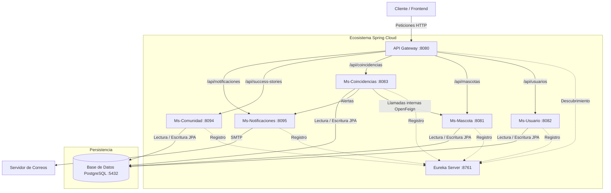

# Proyecto Sanos y Salvos (DNF-Backend)

Este proyecto es una arquitectura de microservicios desarrollada con **Java Spring Boot**, diseñada para gestionar el reporte y búsqueda de mascotas perdidas y encontradas.

## Arquitectura del Sistema

La solución utiliza una arquitectura distribuida orquestada con **Docker Compose**, que incluye servicios de descubrimiento, puerta de enlace y microservicios de negocio.

### Diagrama de Arquitectura



### Componentes de Infraestructura

- **Eureka Server (`eurekaserver`):** Actúa como el Directorio de Servicios, permitiendo que los microservicios se registren y se localicen entre sí dinámicamente.
- **API Gateway (`Api-Gateway`):** Punto de entrada único para el frontend. Utiliza `Spring Cloud Gateway MVC` para enrutar las peticiones a los servicios correspondientes mediante balanceo de carga (`lb://`).
- **Base de Datos:** Instancia compartida de **PostgreSQL** para la persistencia de datos de todos los servicios de negocio.
- **Servicio de Cache (Redis):** Utilizado por varios microservicios (`Ms-mascota`, `Ms-usuario`, `Ms-coincidencias`, `Ms-comunidad`) para mejorar el rendimiento mediante el almacenamiento en caché de datos frecuentemente accedidos. El servicio `dnf-redis` se orquesta vía `docker-compose.yml`.

---

## Detalle de Microservicios

### 1. Ms-Usuario (Gestión de Usuarios y Seguridad)
Responsable de la administración de usuarios y la seguridad perimetral de la aplicación.
- **Funcionalidad:** Registro de usuarios, perfiles y autenticación.
- **Extras:** 
    - **JWT (JSON Web Token):** Implementa seguridad mediante tokens compactos y seguros.
    - **Proceso JWT:** Al iniciar sesión, el servicio genera un token firmado con una clave secreta (HMAC-SHA). Este token debe ser enviado en el encabezado `Authorization: Bearer <token>` para acceder a recursos protegidos.
    - **Filtros de Seguridad:** Utiliza `JwtFilter` para interceptar y validar la integridad y expiración de cada petición.

### 2. Ms-Mascota (Gestión de Reportes)
Corazón del sistema para el manejo de la información de los animales.
- **Funcionalidad:** CRUD completo de mascotas reportadas como perdidas o encontradas, permitiendo subir detalles como especie, raza, ubicación y estado.
- **Extras:** Integración fluida con JPA y PostgreSQL para búsquedas geográficas y por atributos.
    - **RabbitMQ:** Publica eventos de mascotas (perdidas/encontradas) para comunicación asíncrona con otros servicios.

### 3. Ms-Coincidencias (Motor de Match)
Servicio inteligente que busca conexiones entre reportes de mascotas perdidas y encontradas.
- **Funcionalidad:** Analiza la base de datos para encontrar posibles matches.
- **Extras:**
    - **OpenFeign:** Se comunica de forma declarativa con `Ms-Mascota` para obtener datos de los reportes.
    - **Resilience4j:** Implementa patrones de tolerancia a fallos (Circuit Breaker) para asegurar que el sistema sea resiliente si otros servicios fallan.
    - **LoadBalancer:** Distribuye las peticiones entre múltiples instancias de servicios de forma automática.

### 4. Ms-Comunidad (Historias de Éxito)
Espacio dedicado a la interacción social y la publicación de reencuentros.
- **Funcionalidad:** Gestión de "Historias de Éxito", donde los usuarios comparten sus experiencias positivas tras recuperar a sus mascotas.
- **Extras:** Fomenta la participación comunitaria y valida el impacto del sistema.

### 5. Ms-Notificaciones (Servicio de Alertas)
Encargado de mantener informados a los usuarios en tiempo real.
- **Funcionalidad:** Envío de correos electrónicos cuando se detecta una coincidencia o una actualización relevante.
- **Extras:** 
    - **JavaMailSender:** Integración con protocolos SMTP para el envío de notificaciones.
    - **Emails Automáticos:** Se activa mediante llamadas internas de otros servicios para alertar a los dueños.
    - **RabbitMQ:** Consume eventos de mascotas para enviar notificaciones personalizadas.

---

## Ejecución y Puertos

El proyecto está configurado para correr completamente mediante contenedores.

### Requisitos
- Docker y Docker Compose
- Java 21 (para desarrollo local)
- Maven 3.9+

### Pasos para iniciar
```bash
docker compose up -d --build
```

```bash
docker compose exec -T postgres-db psql -U admin -d dnf_db < poblar-bd.sql
```

### Mapa de Puertos
| Servicio | Puerto Local | Path Base API |
|---|---|---|
| `eurekaserver` | 8761 | / |
| `Api-Gateway` | 8080 | / |
| `Ms-mascota` | 8081 | `/api/mascotas` |
| `Ms-usuario` | 8082 | `/api/usuarios` |
| `Ms-coincidencias` | 8083 | `/api/coincidencias` |
| `Ms-comunidad` | 8094 | `/api/success-stories` |
| `Ms-notificaciones` | 8095 | `/api/notificaciones` |
| `postgres-db` | 5433 | DB: `dnf_db` |

---

## Cobertura de Código (JaCoCo)

- La mayoría de los microservicios (`Ms-notificaciones`, `Ms-mascota`, `Ms-coincidencias`, `Ms-usuario`, `Ms-comunidad`) incluyen el plugin JaCoCo Maven (`jacoco-maven-plugin`).
- Esto permite la generación de informes de cobertura de código durante la fase de `package` de Maven, ayudando a asegurar la calidad del código.

## Documentación de API

Para consultar el detalle completo de las rutas HTTP, métodos y su descripción, puedes referirte al archivo [ENDPOINTS.md](./ENDPOINTS.md).

Adicionalmente, cada microservicio de negocio integra **Springdoc OpenAPI (Swagger)**. Puedes acceder a la documentación interactiva en:
`http://localhost:<puerto-del-servicio>/swagger-ui.html`

---
*Desarrollado para la plataforma Sanos y Salvos.*
